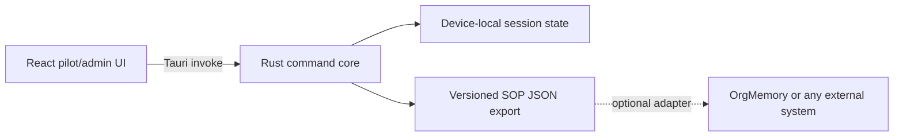

# Architecture

This file records only behavior present in the repository.

## Current system

- `src/` contains the React 19 control room, pilot SOP flow, admin health view, and a browser demonstration bridge.
- `src-tauri/` contains Tauri 2 commands for capture state, evidence selection, deterministic SOP drafting, and local JSON export.
- The Rust core forbids unsafe code.
- Exported evidence is selected by the pilot; unselected evidence is excluded from the SOP.
- No server, account, private repository, or OrgMemory deployment is required.

## Not built yet

Windows screen capture, UI Automation extraction, audio transcription, SQLite persistence, MCP serving, model-backed SOP synthesis, fleet enrollment, and remote policy sync remain planned work.
