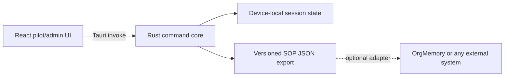

# Architecture

This file records only behavior present in the repository.

## Current system

- `src/` contains the React 19 control room, explicit demo consent scope, source status, named-session SOP prompt, teammate verification gate, admin health view, and a browser demonstration bridge.
- `src-tauri/` contains Tauri 2 commands for capture state, evidence selection, deterministic SOP drafting, review-gated local JSON export, and timestamped evidence locators.
- The Rust core forbids unsafe code.
- Exported evidence is selected by the pilot; unselected evidence is excluded from the SOP. An export requires a reviewer label and all human-verification flags to be resolved.
- The public `1.1` envelope carries the repeatable 60-minute recipe, review record, decisions, exceptions, and evidence locators.
- No server, account, private repository, or OrgMemory deployment is required.

## Not built yet

Windows screen capture, UI Automation extraction, audio transcription, SQLite persistence, evidence playback, editable SOP content, durable pipes, MCP serving, model-backed SOP synthesis, fleet enrollment, and remote policy sync remain planned work. All source and fleet status shown today is explicitly labeled demo data.
