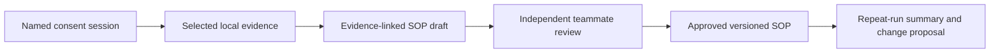

# Enterprise pilot specification

## Objective

Prove that a consenting operator can complete one real desktop workflow and produce a traceable draft SOP that another teammate can verify, approve, and reuse.

## Proposed two-week scope

- One enterprise tenant and one support, finance-operations, operations, or QA team.
- 5–10 named participants: operators, at least one independent reviewer, one pilot admin, and a process owner.
- One primary workflow using 2–4 approved Windows applications.
- 8–15 named sessions, including at least three repetitions.
- One approved SOP, evidence-linked drafts, review history, repeat-run reports, and a pilot scorecard.

Choose a workflow that runs several times per week, takes roughly 10–30 minutes, has a clear completion state, and does not require capturing credentials or highly restricted data.

## Golden workflow

1. The process owner defines purpose, approved applications, prohibited data, retention, owner, reviewer, and expected output.
2. The operator reviews sources and starts a visible named session. Audio is off unless separately consented.
3. The operator completes one clean pass in normal tools and stops capture.
4. The pipe uses only evidence from that named session to produce purpose, prerequisites, systems, numbered actions, decisions, exceptions, escalation paths, expected output, timestamped evidence, and human-verification flags.
5. The operator previews, redacts, corrects, or deletes the draft.
6. An independent teammate verifies evidence and approves or rejects it.
7. The approved version is exported locally or published through an optional adapter with owner, version, review record, and source permissions.
8. Later sessions use the same recipe to produce a run summary and proposed changes; approved content is never overwritten automatically.

## Recommended instruction

> Using only capture session `{session_id}`, create a training SOP for a new teammate. Use screen text, separately consented transcript, approved app names, and timestamped timeline evidence. Include systems used, numbered actions, decisions, exceptions, escalation paths, and expected output. Cite evidence for each factual step. Label anything inferred, ambiguous, or unsupported as `Human verification required`. Exclude content outside this session and from denied applications.

## Proposed success scorecard

- At least eight valid sessions and three repeat runs.
- At least 80% of drafted steps accepted without material correction.
- At least 90% of accepted steps have reviewer-accessible evidence.
- Every unsupported statement is flagged before approval.
- Median capture-to-reviewed-SOP effort is at most 30 minutes and at least 50% below the agreed manual baseline.
- A non-author teammate completes the workflow without live author help, with no critical error and at most one clarification.
- Pause, stop, preview, redaction, deletion, and retention controls are exercised.
- Zero silent/off-scope capture, permission leakage, or unresolved sensitive-data incidents.

These are pilot hypotheses, not claims about the current seeded demonstration.

## Privacy and admin boundary

- Capture is opt-in, named, session-scoped, visible, and never remotely initiated.
- Audio is off by default and separately consented.
- Raw capture remains on the endpoint by default.
- Operators can pause, preview, redact, or delete before submission.
- Admins see enrollment, version, health, policy, storage, and consent metadata—not raw content.
- No productivity scoring, behavioral profiling, cross-user raw-activity search, or automatic AI publication.

Suggested pilot retention is seven days for raw capture and 30 days for unapproved drafts; an enterprise deployment must make both configurable and auditable.

## Go / extend / stop

- **Go:** all consent, access, deletion, evidence, and human-approval gates pass and the quality/transfer targets are met.
- **Extend narrowly:** privacy gates pass but draft quality or usability misses by a correctable margin.
- **Stop:** any silent/off-scope capture, permission leak, failed deletion, untraceable approved content, monitoring pressure, or review effort equal to manual SOP writing.

## Pilot blockers in the current repository

The current repository is a seeded contract demonstration. Live native capture, audio/transcription, persistence, model grounding, editable review, durable pipe execution, real fleet heartbeat, and signed deployment remain required before enrolling enterprise users.
