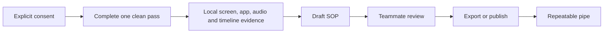

# Vision

Operational knowledge should not disappear when a skilled teammate changes role or leaves. OrgMemory Edge turns one clean run of real work into a draft process while keeping the human in control of what is recorded and published.

## Primary users

- **Pilot:** records a workflow and receives a useful, editable SOP draft.
- **Reviewer:** marks guessed, missing, or incorrect steps before approval.
- **Admin:** sees device health, version, consent, and policy metadata without default access to raw employee context.

## North-star flow

Every SOP must identify systems used, ordered steps, decisions, exceptions, evidence links, and anything requiring human verification.

## Product boundaries

- Local-first and useful without a cloud account.
- Capture is visible, pausable, scoped, and denylist-aware.
- Raw evidence is not an admin surveillance feed.
- Model providers, transcription engines, storage backends, MCP, and OrgMemory publishing are replaceable adapters.
- The repository is a clean-room implementation. It does not copy or link Screenpipe source code.

## v0.1 target

Windows desktop, explicit capture, application/window timeline, optional audio track, human-reviewed SOP generation, local JSON/Markdown export, and one reusable pipe recipe.
